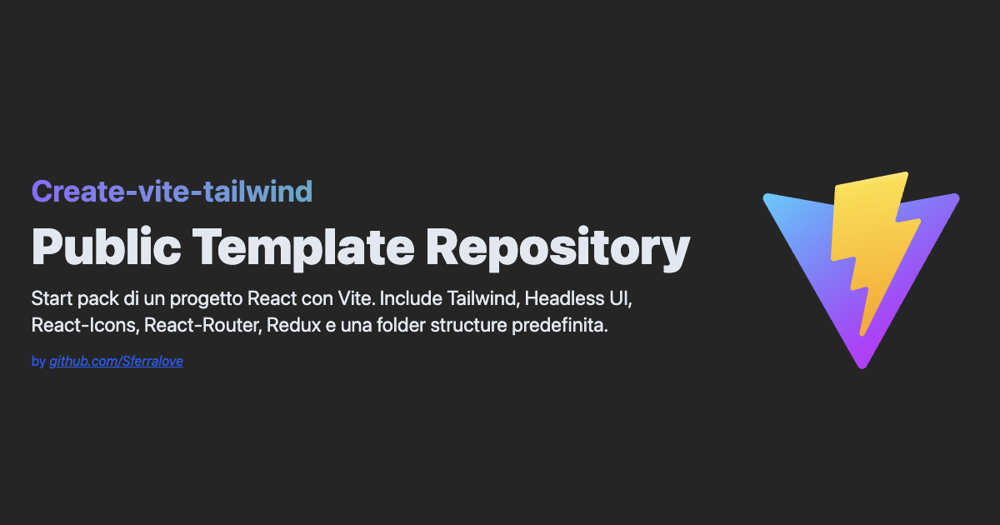

# Create Vite Tailwind



A production-ready starter template for modern React applications built with Vite and Tailwind CSS.

This repository is designed to be used as a public GitHub template. It gives you a clean frontend baseline with routing, state management, UI utilities, linting, formatting, testing, and pre-commit automation already in place, so you can start building features instead of wiring tooling from scratch.

## Why this template

- Fast setup for new React + Vite projects
- Tailwind CSS 4 and common UI utilities included
- ESLint, Prettier, Vitest, and Testing Library configured
- Husky + lint-staged pre-commit workflow enabled
- Routing, Redux, Axios, and reusable project structure ready to use
- Vite path aliases configured for a cleaner import experience

## Tech stack

- React 19
- Vite 7
- Tailwind CSS 4
- React Router 7
- Redux 5 + React Redux 9
- Axios
- Headless UI
- Lucide React + React Icons
- Vitest + Testing Library
- ESLint + Prettier
- Husky + lint-staged

## Quick start

### Use this template on GitHub

Click `Use this template` on GitHub to create a new repository from this starter.

### Or clone it directly

```bash
git clone https://github.com/Sferralove/create-vite-tailwind.git my-app
cd my-app
npm install
npm run dev
```

Open the local URL shown by Vite, usually `http://localhost:5173`.

## Requirements

- Node.js `20.19+` or `22.12+`
- npm `10+`

## Available scripts

```bash
npm run dev
npm run build
npm run preview
npm run lint
npm run format
npm run format:check
npm run test
npm run test:run
```

## Recommended local workflow

```bash
npm install
npm run dev
npm run lint
npm run test:run
npm run build
```

## What is included

### Tooling

- ESLint with Airbnb-based React rules and Prettier compatibility
- Prettier for consistent formatting
- Vitest with `jsdom` for unit and component tests
- Testing Library and `jest-dom` for UI testing
- Husky + lint-staged to run checks on staged files before commit

### Project structure

The `src` folder already includes a scalable baseline:

- `assets`
- `components`
- `context`
- `pages`
- `services`
- `test`
- `utils`
- `views`

### Path aliases

Aliases are configured in [vite.config.js](./vite.config.js):

- `@` -> `src`
- `@assets`
- `@components`
- `@context`
- `@pages`
- `@services`
- `@utils`
- `@views`

## First things to customize

After creating your own project from this template, update these files first:

1. Change the project name in `package.json`.
2. Update the page title, metadata, and favicon in `index.html`.
3. Replace the demo UI in `src/App.jsx`.
4. Replace demo assets in `src/assets`.
5. Adjust base styles and design tokens in `src/index.css`.
6. Update this `README.md` with your project-specific documentation.
7. If needed, remove any libraries you do not plan to use.

## Testing

Vitest is configured through [vite.config.js](./vite.config.js), and a starter test is included.

Run the test suite with:

```bash
npm run test:run
```

For watch mode:

```bash
npm run test
```

## Code quality

This template includes:

- ESLint for code quality checks
- Prettier for code formatting
- Husky + lint-staged for pre-commit checks on staged files

Current pre-commit behavior:

- `*.js`, `*.jsx`: run ESLint with `--fix`, then Prettier
- `*.css`, `*.html`, `*.json`, `*.md`: run Prettier

## Deployment notes

- `.htaccess` is included for Apache SPA route fallback support
- `Web.config` is included for IIS deployments

## Who this template is for

This template is a strong starting point for:

- React single-page applications
- admin panels and dashboards
- internal tools
- CRUD applications
- frontend projects that need solid tooling from day one

If you need TypeScript, SSR, or a minimal dependency footprint, you may want to adapt this starter before using it in production.

## License

This project is licensed under the MIT License. See [LICENSE](./LICENSE) for details.

## Author

Angelo Sferra  
GitHub: [@Sferralove](https://github.com/Sferralove)
